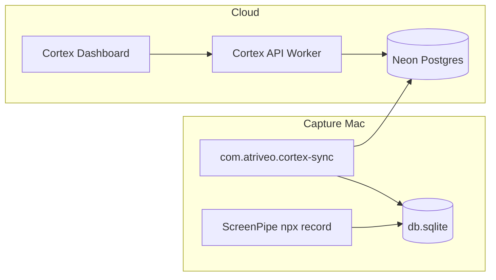

# Capture Reliability Report (Phase 7A)

**Goal:** Cortex continuously collects ScreenPipe data without manual intervention.

**Production:** https://cortex.atriveo.com  
**Capture Mac data:** `/Volumes/Kasliwal v2/screenpipe-data/db.sqlite`  
**Repo:** `working-memory/` (atriveo-cortex)

---

## 1. Architecture



| Component | Role |
|-----------|------|
| `com.atriveo.screenpipe` | Keeps ScreenPipe recording on login; restarts on crash |
| `com.atriveo.cortex-sync` | Delta sync every 5 minutes → Neon analytics |
| `sync_state` (Neon) | Heartbeats written by Mac agent; cloud health reads these |
| Dashboard banner | LIVE / SYNCING / STALE / OFFLINE from pipeline evaluation |

---

## 2. launchd Setup

### Agents

| Label | Schedule | Script |
|-------|----------|--------|
| `com.atriveo.screenpipe` | RunAtLoad + KeepAlive | `capture/run-screenpipe.sh` |
| `com.atriveo.cortex-sync` | RunAtLoad + StartInterval 300s | `capture/run-cortex-sync.sh` |

### Install

```bash
cd "/Volumes/Kasliwal v2/working-memory"
chmod +x capture/*.sh
./capture/install-capture-agents.sh
```

This copies plists to `~/Library/LaunchAgents/`, deploys shell scripts to `~/Library/Application Support/Atriveo/capture/` (launchd cannot execute scripts directly on external volumes), and bootstraps both agents.

### ScreenPipe permissions (launchd)

When ScreenPipe runs under launchd (not Terminal), macOS TCC may block screen recording / microphone until you grant access to the `screenpipe` binary or `node` under **System Settings → Privacy & Security**. Check `~/Library/Logs/Atriveo/screenpipe.log` for `checking permissions...`. Sync still works from SQLite even when the API port is closed.

### External volume + launchd

macOS blocks launchd from executing scripts on external volumes. `install-capture-agents.sh` deploys runnable copies to `~/Library/Application Support/Atriveo/capture/`. Re-run install after editing `capture/*.sh` in the repo.

Both agents wait up to 5 minutes for `/Volumes/Kasliwal v2` before starting (`capture/wait-for-volume.sh`). Override with `CORTEX_DRIVE_ROOT` or `CORTEX_VOLUME_WAIT_SEC`.

### ScreenPipe data directory

`run-screenpipe.sh` sources `/Volumes/Kasliwal v2/screenpipe-env.sh`, which sets:

```
SCREENPIPE_DATA_DIR=/Volumes/Kasliwal v2/screenpipe-data
```

Then runs `start-screenpipe.sh` → `npx screenpipe record --data-dir … --port 3030`.

### Logs

| Log | Path |
|-----|------|
| ScreenPipe stdout/stderr | `~/Library/Logs/Atriveo/screenpipe.log` |
| ScreenPipe launchd wrapper | `~/Library/Logs/Atriveo/screenpipe.launchd.log` |
| Sync runs (JSON per run) | `~/Library/Logs/Atriveo/cortex-sync.log` |
| Sync launchd wrapper | `~/Library/Logs/Atriveo/cortex-sync.launchd.log` |

### Manual control

```bash
launchctl kickstart -k "gui/$(id -u)/com.atriveo.screenpipe"
launchctl kickstart -k "gui/$(id -u)/com.atriveo.cortex-sync"
launchctl bootout "gui/$(id -u)/com.atriveo.screenpipe"   # stop
```

---

## 3. Sync Schedule

- **Interval:** every 5 minutes (`StartInterval: 300` in `com.atriveo.cortex-sync.plist`)
- **Entry:** `npm run sync:screenpipe` via `capture/run-cortex-sync.sh`
- **Config:** `playground/.env.sync` (copy from `.env.sync.example`)

### Delta sync behavior

`playground/lib/sync/screenpipe-sync.ts`:

1. Probes ScreenPipe API (port 3030) and records reachability in `sync_state`
2. Reads `last_frame_timestamp` watermark from Neon
3. **Skips** processing when no new frames since watermark
4. Otherwise syncs only affected local calendar dates (`getLocalDatesWithFrames`)
5. Runs `ensureDaySynced` per date → sessions, app usage, website usage, daily summary
6. Updates `sync_state` heartbeat keys

### Duplicate avoidance

- Per-day sync clears analytics for that date before insert (`clearAnalyticsForDate`)
- Watermark skip prevents reprocessing unchanged SQLite tail
- `sync_state.last_frame_timestamp` tracks latest ScreenPipe frame seen

### sync_state keys (Neon)

| Key | Meaning |
|-----|---------|
| `last_processed_timestamp` | Agent heartbeat (every run) |
| `last_frame_timestamp` | Latest frame in ScreenPipe SQLite |
| `last_sync_completed_at` | Last run that wrote analytics |
| `last_sync_records_processed` | Records in last meaningful sync |
| `capture_port_open` | `1` if port 3030 open |
| `capture_api_reachable` | `1` if health API responds |
| `capture_agent_heartbeat` | Last agent touch time |

---

## 4. Health Architecture

Cloud Worker cannot probe localhost on the Mac. Health is **inferred from Neon `sync_state`** written by the Mac sync agent.

### Evaluation (`playground/lib/sync/capture-pipeline-health.ts`)

| Signal | Threshold |
|--------|-----------|
| Capture active | last frame ≤ 5 min |
| Capture stale | last frame > 30 min |
| Sync healthy | last sync ≤ 10 min |
| Sync stale | last sync > 30 min or never |
| Analytics stale | last frame > last sync by > 15 min |

### Distinctions

| Check | Source |
|-------|--------|
| ScreenPipe running | `capture_port_open` |
| ScreenPipe capturing | `last_frame_timestamp` freshness |
| Sync healthy | `last_sync_completed_at` ≤ 10 min |
| Sync stale | sync age > 30 min |
| Analytics stale | frame watermark ahead of sync watermark |

### Dashboard states

| State | Condition |
|-------|-----------|
| **LIVE** | Capturing + sync fresh + analytics current |
| **SYNCING** | New capture; analytics catching up |
| **STALE** | Historical data shown; capture or sync lagging |
| **OFFLINE** | No recent activity and no data for view |

API: `GET /api/system/screenpipe-health` → `pipelineStatus` field.  
UI: `apps/cortex-ui/src/lib/activity/activity-state.ts` + capture banner.

---

## 5. Recovery Behavior

| Failure | Recovery |
|---------|----------|
| ScreenPipe crash | launchd KeepAlive restarts `run-screenpipe.sh` |
| External drive late mount | `wait-for-volume.sh` blocks up to 5 min |
| Sync script error | Logged to `cortex-sync.log`; next run in 5 min |
| ScreenPipe down but SQLite has frames | Sync still processes SQLite; port flags show offline |
| Neon unreachable | Sync fails loudly in log; dashboard goes STALE/OFFLINE |
| Reboot | Both agents start at login (RunAtLoad) |

After reboot success criteria:

1. `lsof -i :3030` shows ScreenPipe within ~1 min of login (after volume mount)
2. `cortex-sync.log` shows a run within 5 min
3. Dashboard shows LIVE or SYNCING (not OFFLINE) when Mac is actively used

---

## 6. Backfill

One-time import of historical ScreenPipe data into Neon analytics.

```bash
cd playground
cp .env.sync.example .env.sync   # if not already configured
npm run backfill:analytics
# Optional range:
npm run backfill:analytics -- --from 2026-01-01 --to 2026-06-17
```

Script: `playground/scripts/backfill-analytics.ts`

- Discovers date range from ScreenPipe SQLite (`getFrameDateRange`)
- Runs `syncDateRange` for each day
- Populates: `daily_summaries`, `sessions`, `application_usage`, `website_usage`
- Updates `sync_state` watermarks

### Backfill status

Run after install to populate historical dates. Safe to re-run: per-day clear + insert prevents duplicates.

Check progress:

```bash
cd playground && npm run db:verify
```

---

## 7. Operational Checklist

### First-time setup

- [ ] External drive mounted at `/Volumes/Kasliwal v2`
- [ ] `playground/.env.sync` exists with `DATABASE_URL` (Neon) and `SCREENPIPE_DB`
- [ ] `./capture/install-capture-agents.sh`
- [ ] `npm run backfill:analytics` (historical data)
- [ ] Verify https://cortex.atriveo.com shows LIVE after using Mac ~10 min

### Daily verification

```bash
# ScreenPipe listening
lsof -i :3030

# Recent sync log
tail -20 ~/Library/Logs/Atriveo/cortex-sync.log

# Agent status
launchctl print "gui/$(id -u)/com.atriveo.screenpipe" | head -20
launchctl print "gui/$(id -u)/com.atriveo.cortex-sync" | head -20

# API health (production)
curl -s https://cortex.atriveo.com/api/system/screenpipe-health | jq .
```

### Troubleshooting

| Symptom | Action |
|---------|--------|
| OFFLINE on dashboard | Check agents loaded; tail sync log; verify `.env.sync` |
| STALE, port closed | `kickstart` screenpipe agent; check `screenpipe.log` |
| SYNCING stuck | Run `npm run sync:screenpipe` manually; check Neon connectivity |
| No historical weeks | Run `backfill:analytics` |
| Volume not found at boot | Increase `CORTEX_VOLUME_WAIT_SEC`; ensure drive auto-mounts |

---

## 8. Files Added/Changed (Phase 7A)

```
capture/
  wait-for-volume.sh
  run-screenpipe.sh
  run-cortex-sync.sh
  install-capture-agents.sh
  com.atriveo.screenpipe.plist
  com.atriveo.cortex-sync.plist
playground/
  lib/sync/sync-keys.ts
  lib/sync/capture-pipeline-health.ts
  lib/sync/screenpipe-sync.ts
  lib/sync/sync-status.ts
  scripts/backfill-analytics.ts
apps/cortex-ui/
  src/lib/activity/activity-state.ts
  src/components/activity/activity-capture-banner.tsx
```

---

*Generated: Phase 7A — Capture Reliability*
