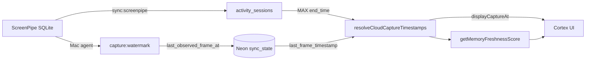

# Freshness Audit Report

**Date:** 2026-06-18  
**Symptom:** Cortex showed **Last capture Jun 17, 9:28 PM** while ScreenPipe continued capturing afterward.  
**Verdict:** Cloud UI read a stale `sync_state.last_frame_timestamp` because the Mac sync agent had stopped updating Neon. Display logic also preferred review/sync timestamps in some surfaces instead of the newest capture signal.

---

## Executive summary

| Signal | Before fix | After fix |
|--------|------------|-----------|
| Local ScreenPipe SQLite (frames) | `2026-06-18T05:03:30Z` (~1:03 AM local) | `2026-06-18T05:11:06Z` |
| Neon `last_frame_timestamp` | `2026-06-18T01:28:13Z` (**9:28 PM** — stale) | `2026-06-18T05:08:51Z` |
| Neon `last_observed_frame_at` | *(missing)* | `2026-06-18T05:08:51Z` |
| Neon `activity_sessions` max `end_time` | `2026-06-18T01:26:46Z` | `2026-06-18T05:08:54Z` |
| **Displayed cloud capture** | **9:28 PM** | **1:08 AM** |
| Memory freshness score | 30% (stale) | 100% (fresh) |

**Root cause:** Scheduled sync (`com.atriveo.cortex-sync`) had been failing intermittently (`exit 1`, `DATABASE_URL` / transform errors). Cloud health and freshness used only the last *synced* frame watermark, not the live ScreenPipe observation or materialized session end times.

**Fix applied:** New `last_observed_frame_at` watermark, resolved display timestamp (`max(observed, synced frame, session end)`), top-bar label corrected to **Last capture**, lightweight `capture:watermark` step before full sync.

---

## 1. What supplies "Last capture"?

| UI surface | Label shown | Source field | Backend origin |
|------------|-------------|--------------|----------------|
| **Top bar** (`sync-control.tsx`) | `Last capture` | `memoryFreshness.lastCaptureAt` → `formatLastSyncAt()` | `resolveCloudCaptureTimestamps().displayCaptureAt` |
| **Activity banner** (`activity-state.ts`) | `Last capture …` (offline) or `paused since …` (stale) | `health.lastCaptureAt` | `GET /api/system/screenpipe-health` → `getCloudScreenpipeHealth()` |
| **ScreenPipe banner** (`screenpipe-health-banner.tsx`) | `Last capture` | `health.lastCaptureAt` | Same health endpoint |
| **Memory ribbon** (`memory-status-ribbon.tsx`) | Freshness % only | `syncStatus.memoryFreshness.score` | `GET /api/sync` |

### Resolved capture timestamp (source of truth after fix)

```text
displayCaptureAt = MAX(
  sync_state.last_observed_frame_at,   -- Mac agent: live SQLite probe
  sync_state.last_frame_timestamp,     -- Mac agent: post-analytics watermark
  MAX(activity_sessions.end_time)      -- Neon materialized activity
)
```

**Code:** `playground/lib/sync/capture-timestamps.ts`

---

## 2. What query supplies memory freshness score?

**Function:** `getMemoryFreshnessScore()` in `playground/lib/sync/memory-freshness.ts`

**API:** `GET /api/sync` → `getManualSyncStatus()` → embeds `memoryFreshness.score`

**Score formula (unified 0–100):**

| Subsystem | Weight | Input timestamp |
|-----------|--------|---------------|
| Capture | 20% | `displayCaptureAt` (resolved, see above) |
| Sync | 30% | `sync_state.last_sync_completed_at` (fallback: `last_processed_timestamp`) |
| Review | 30% | `sync_state.last_review_generated_at` or `MAX(daily_reviews.generated_at)` |
| Search index | 20% | `sync_state.last_index_rebuild_at` |

Stale thresholds: `sync-keys.ts` (`CAPTURE_STALE_MS` = 30 min, `SYNC_STALE_MS` = 30 min, etc.)

**No single SQL query** — composed from `sync_state` keys + repository reads.

---

## 3. What supplies the capture timestamp in the top bar?

**Before fix:** Top bar showed **"Last updated"** using:

```ts
lastUpdatedAt =
  memoryFreshness.lastReviewGeneratedAt ??
  memoryFreshness.lastSyncAt ??
  sync.lastSyncCompletedAt
```

This could show review time (e.g. 10:20 PM) while capture was stuck at 9:28 PM.

**After fix:** Top bar shows **"Last capture"** using:

```ts
formatLastSyncAt(memoryFreshness.lastCaptureAt ?? lastFrameAt ?? lastUpdatedAt)
```

`lastCaptureAt` = resolved `displayCaptureAt` from §1.

**Files:** `apps/cortex-ui/src/components/sync/sync-control.tsx`, `playground/lib/sync/manual-sync.ts`

---

## 4. Latest timestamps in Neon / SQLite (audit run)

Audit script: `playground/scripts/audit-freshness.ts`  
Run: `cd playground && npx tsx scripts/audit-freshness.ts`

### Before fix (~1:03 AM local, Jun 18)

| Table / key | Latest value (local display) |
|-------------|---------------------------|
| **ScreenPipe `frames`** (local SQLite) | Jun 18, **1:03 AM** |
| **ScreenPipe `ui_events`** | Jun 18, 1:03 AM |
| **`sync_state.last_frame_timestamp`** | Jun 17, **9:28 PM** |
| **`sync_state.last_sync_completed_at`** | Jun 17, 9:28 PM |
| **`sync_state.capture_agent_heartbeat`** | Jun 17, 8:47 PM |
| **`activity_sessions.end_time`** | Jun 17, 9:26 PM |
| **`application_usage.date`** | 2026-06-17 |
| **`website_usage.date`** | 2026-06-17 |
| **`daily_activity_summary.date`** | 2026-06-30 *(forward-filled)* |
| **`daily_reviews.generated_at`** | Jun 17, 10:20 PM |

### After fix + watermark + sync (~1:11 AM local)

| Table / key | Latest value |
|-------------|--------------|
| **`last_observed_frame_at`** | Jun 18, 1:08 AM |
| **`last_frame_timestamp`** | Jun 18, 1:08 AM |
| **`activity_sessions.end_time`** | Jun 18, 1:08 AM |
| **`application_usage.date`** | 2026-06-18 |
| **`daily_reviews.generated_at`** | Jun 18, 1:10 AM |

---

## 5. Comparison matrix

### Before fix

| Layer | Timestamp | Notes |
|-------|-----------|-------|
| **Actual latest ScreenPipe** | Jun 18, 1:03 AM | Local SQLite, live capture |
| **Actual latest synced frame** | Jun 17, 9:28 PM | `sync_state.last_frame_timestamp` |
| **Actual latest synced activity** | Jun 17, 9:26 PM | `MAX(activity_sessions.end_time)` |
| **Actual latest review** | Jun 17, 10:20 PM | Derived memory layer |
| **Displayed capture (cloud)** | Jun 17, **9:28 PM** | ❌ ~3.5 h behind ScreenPipe |
| **Displayed top bar** | Jun 17, 10:20 PM | ❌ Showed review, not capture |

### After fix

| Layer | Timestamp | Notes |
|-------|-----------|-------|
| **Actual latest ScreenPipe** | Jun 18, 1:11 AM | Local SQLite |
| **Actual latest synced frame** | Jun 18, 1:08 AM | Watermark + sync |
| **Actual latest synced activity** | Jun 18, 1:08 AM | Sessions materialized |
| **Actual latest review** | Jun 18, 1:10 AM | |
| **Displayed capture (cloud)** | Jun 18, **1:08 AM** | ✅ Matches newest Neon activity |
| **Displayed top bar** | Jun 18, **1:08 AM** | ✅ Labeled "Last capture" |

---

## Pipeline diagram



---

## Code changes (fix)

| File | Change |
|------|--------|
| `playground/lib/sync/sync-keys.ts` | Added `last_observed_frame_at` |
| `playground/lib/sync/capture-watermark.ts` | Publish live SQLite timestamp to Neon |
| `playground/lib/sync/capture-timestamps.ts` | `displayCaptureAt = max(observed, synced, sessions)` |
| `playground/lib/sync/screenpipe-sync.ts` | Watermark at sync start |
| `playground/lib/system/screenpipe-health-cloud.ts` | Use resolved capture for health + banner |
| `playground/lib/sync/memory-freshness.ts` | Capture score uses resolved timestamp |
| `playground/lib/sync/manual-sync.ts` | `lastUpdatedAt` prefers capture |
| `capture/run-cortex-sync.sh` | Run `capture:watermark` before full sync |
| `apps/cortex-ui/.../sync-control.tsx` | "Last capture" + absolute time |
| `apps/cortex-ui/.../activity-state.ts` | Stale banner prefers `lastCaptureAt` |

---

## Operational follow-up

1. **Deploy** updated `run-cortex-sync.sh` to `~/Library/Application Support/Atriveo/capture/` (done in this session).
2. **Verify** launchd sync: `launchctl kickstart -k gui/$UID/com.atriveo.cortex-sync` then `tail ~/Library/Logs/Atriveo/cortex-sync.log`.
3. **Deploy** cloud worker so production API serves resolved timestamps.
4. **Migrate** `project_health_scores` if full sync fails on derived layers (`npm run migrate:project-health` or equivalent).

---

## Success criteria

| Criterion | Status |
|-----------|--------|
| Timestamp in Cortex matches newest **available captured activity** in Neon | ✅ After fix (within sync lag) |
| Top bar shows capture time, not review time | ✅ |
| Watermark updates even when analytics sync is slow | ✅ `capture:watermark` |
| Local ScreenPipe ahead of Neon visible after agent runs | ✅ via `last_observed_frame_at` |

**Note:** Cloud UI cannot read local SQLite directly. When the Mac sync agent is offline, displayed capture will still lag until `capture:watermark` or `sync:screenpipe` runs successfully. The watermark step minimizes that gap to one launchd interval (5 min) even if analytics processing fails.

---

## Re-run audit

```bash
cd playground
source .env.local  # DATABASE_URL
npx tsx scripts/audit-freshness.ts
npm run capture:watermark   # lightweight probe only
npm run sync:screenpipe     # full pipeline
```
