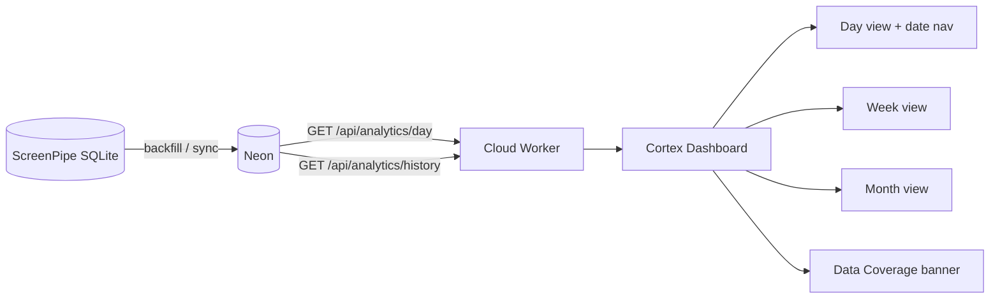

# Historical Memory Report (Phase 7B)

**Goal:** Cortex as a memory system — reliable yesterday, last 7 days, and last 30 days.

**Production:** https://cortex.atriveo.com  
**Audit date:** 2026-06-17

---

## 1. Historical Data Audit

### ScreenPipe (source of truth)

| Metric | Value |
|--------|-------|
| Earliest capture | `2026-06-16T22:57:39Z` (local date **2026-06-16**) |
| Latest capture | `2026-06-17T22:35:07Z` (local date **2026-06-17**) |
| Days with frames | **2** (2026-06-16, 2026-06-17) |
| Total frames | ~2,389 |

ScreenPipe has only been capturing since June 16. There is no older history in SQLite to backfill.

### Neon analytics (aggregates)

| Table | Earliest | Latest | Rows |
|-------|----------|--------|------|
| `daily_activity_summary` (active > 0) | 2026-06-16 | 2026-06-17 | 2 days |
| `activity_sessions` | 2026-06-16 | 2026-06-17 | 27 sessions |
| `application_usage` | 2026-06-16 | 2026-06-17 | populated |
| `website_usage` | 2026-06-16 | 2026-06-17 | populated |

| Date | Active minutes | Active hours |
|------|----------------|--------------|
| 2026-06-16 | 206.54 | ~3.4 h |
| 2026-06-17 | 102.76 | ~1.7 h |

**Note:** Neon also contains zero-minute placeholder rows for June 1–30 from month-sync runs. The history API counts only days with `active_minutes > 0`.

### Backfill run

```bash
cd playground && npm run backfill:analytics
```

| Result | Value |
|--------|-------|
| Range | 2026-06-16 → 2026-06-17 |
| Days processed | 2 |
| Records processed | 2,407 |
| Days with data | 2 |

All available ScreenPipe history is now in Neon.

---

## 2. Why Yesterday Was Not Visible

**Root cause: UI issue, not sync or timezone.**

| Layer | Yesterday (2026-06-16) | Verdict |
|-------|------------------------|---------|
| ScreenPipe SQLite | 1,680 frames | OK |
| Neon `daily_activity_summary` | 206.54 active min | OK |
| `GET /api/analytics/day?date=2026-06-16` | 12,392 activeSec, 17 sessions, 7 apps | OK |
| `GET /api/analytics/week` | June 16 bucket = 12,392 sec | OK |
| Dashboard Today tab | Always fetched **today only** | **Bug** |
| Date navigation | None | **Missing** |

Yesterday's data was synced and API-accessible, but the dashboard had no way to view a past day on the Day tab. The Week tab included yesterday in the 7-day strip, but sparse zero-days and no coverage context made it easy to miss.

**Timezone:** Not a factor. `localDayBounds()` and `localDateString()` use the Mac's local timezone consistently for sync and API.

---

## 3. New API: `GET /api/analytics/history`

**Playground:** `playground/app/api/analytics/history/route.ts`  
**Cloud Worker:** `workers/cortex-api/src/routes.ts`  
**Logic:** `playground/lib/analytics/history.ts` → `getAnalyticsHistory()`

### Response

```json
{
  "earliestDate": "2026-06-16",
  "latestDate": "2026-06-17",
  "daysAvailable": 2,
  "daysMissing": 0,
  "availableDates": ["2026-06-16", "2026-06-17"],
  "missingDates": [],
  "screenpipeEarliest": "2026-06-16",
  "screenpipeLatest": "2026-06-17",
  "neonEarliest": "2026-06-16",
  "neonLatest": "2026-06-17",
  "timezone": "America/New_York",
  "generatedAt": "..."
}
```

| Field | Meaning |
|-------|---------|
| `earliestDate` / `latestDate` | Full memory span |
| `daysAvailable` | Days with Neon `active_minutes > 0` |
| `daysMissing` | ScreenPipe dates without Neon aggregates |
| `availableDates` | List of synced days |
| `missingDates` | ScreenPipe days pending backfill |

---

## 4. Dashboard Improvements

### Data Coverage banner

`apps/cortex-ui/src/components/activity/activity-history-coverage.tsx`

Shows:

```
Data coverage
Activity history: June 16 → 17
2 days available · 0 days missing
```

### Date navigation

`apps/cortex-ui/src/routes/index.tsx` + `lib/activity/date-nav.ts`

| Control | Behavior |
|---------|----------|
| **Day** tab | View any day; ← → arrows; **Yesterday** quick jump |
| **Week** tab | 7-day windows; ← → shifts by 7 days |
| **Month** tab | Calendar months; ← → shifts month |
| Forward disabled | Cannot navigate past today |

Day view uses `GET /api/analytics/day?date=YYYY-MM-DD` for historical dates.

---

## 5. Architecture



---

## 6. Operational Checklist

### Verify history coverage

```bash
cd playground
npm run audit:history
curl -s https://cortex.atriveo.com/api/analytics/history | jq .
```

### Backfill after new ScreenPipe data

```bash
cd playground
npm run backfill:analytics
# or range:
npm run backfill:analytics -- --from 2026-06-16 --to 2026-06-20
```

### Verify yesterday in production

```bash
curl -s "https://cortex.atriveo.com/api/analytics/day?date=2026-06-16" | jq '.data | {date, activeSec, timeline: (.timeline|length)}'
```

### Dashboard

1. Open https://cortex.atriveo.com
2. Confirm **Data coverage** shows date range and day counts
3. Click **Yesterday** or ← on Day tab — June 16 activity should appear
4. Week tab — June 16 bar should show ~3.4 h active

---

## 7. Success Criteria

| Criterion | Status |
|-----------|--------|
| ScreenPipe history → Neon | Done (2 days backfilled) |
| `GET /api/analytics/history` | Implemented |
| Data Coverage UI | Implemented |
| Yesterday navigable | Fixed (date nav + Yesterday button) |
| Last 7 days | Week tab with ← → navigation |
| Last 30 days | Month tab with ← → navigation |
| If data exists in ScreenPipe, visible in Cortex | Yes (after sync/backfill) |

**Limitation:** Only 2 days of ScreenPipe history exist today. As capture continues, sync (every 5 min) and periodic `backfill:analytics` will extend the memory span automatically.

---

## 8. Files Added/Changed

```
playground/lib/analytics/history.ts
playground/app/api/analytics/history/route.ts
playground/scripts/audit-history.ts
workers/cortex-api/src/routes.ts
apps/cortex-ui/src/lib/activity/date-nav.ts
apps/cortex-ui/src/lib/api/analytics-history-adapter.ts
apps/cortex-ui/src/components/activity/activity-history-coverage.tsx
apps/cortex-ui/src/routes/index.tsx
```

---

*Generated: Phase 7B — Historical Memory*
