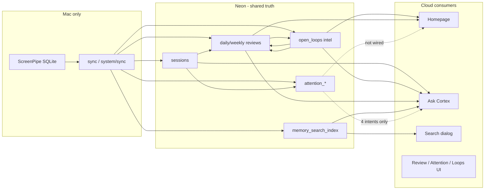

# Phase 14.1 — Production Integration Audit

**Audited:** 2026-06-18  
**Production API:** `https://cortex.atriveo.com/api/*` (Cloudflare Worker → Neon)  
**Production UI:** `https://cortex-ui-6q0.pages.dev` (Pages; custom domain UI pending DNS)  
**Method:** Live API probes + code-path tracing across playground libs shared by Worker

---

## Executive verdict

Cortex is **deployed as a unified stack** (Worker + Pages + Neon) with **route parity** for all Phase 14 systems, but it does **not yet operate as one memory platform in production**. Systems share a database yet behave like **independent features** because:

1. **Ingestion is Mac-local** while intelligence is cloud-read — sync is stale and manual sync is broken in prod (`canManualSync: false`).
2. **Cross-system wiring is partial** — reviews ↔ loops yes; homepage ↔ attention no; chat ↔ search composition weak.
3. **Metrics diverge** — session duration, attention allocation, and review focus scores use different formulas and attribution fields.
4. **UI is split across origins** — API on `cortex.atriveo.com`, UI on `*.pages.dev` until DNS cutover.

**Integration maturity: 62/100** — deployed together, not fully integrated.

---

## Production topology (verified live)

```text
Mac Mini (capture)
  ScreenPipe SQLite ──5min cron──► POST /api/system/sync (playground :3456)
                                        │
                                        ▼
                                 Neon PostgreSQL ◄── Worker cortex-api
                                        ▲
Browser ──► cortex-ui-6q0.pages.dev (UI)     cortex.atriveo.com/api/* (API)
```

| Probe (2026-06-18) | Result |
|--------------------|--------|
| `GET /api/health` | ✅ `healthy`, database connected |
| `GET /api/sync` | ⚠️ `pipelineStatus: stale`, last sync ~108m ago, `canManualSync: false` |
| `POST /api/sync` | ❌ `ScreenPipe unavailable` (no Mac DB, no relay) |
| `GET /api/attention/week` | ✅ `attentionScore: 30`, 2 projects |
| `GET /api/open-loops` | ✅ Board payload (high/medium/low buckets) |
| `GET /api/reviews/day?date=2026-06-17` | ✅ headline present |
| `GET /api/reviews/day` (no date) | ⚠️ 404 if today has no review row |
| `GET /api/search?q=screenpipe` | ✅ 6 hits |
| `POST /api/chat` | ✅ `open_loops_unfinished`, 8 citations |
| `GET cortex-ui-6q0.pages.dev/api/health` | ❌ Returns HTML (API not on Pages origin) |

---

## Per-system audit

| System | Deployed | Data freshness | UI visible | API correct | Cross-integrated | Grade |
|--------|----------|----------------|------------|-------------|------------------|-------|
| **Attention Engine** | ✅ Worker 4 routes | ⚠️ Stale sync; scores exist | ✅ `/attention` | ✅ Reads Neon | ⚠️ Not on homepage; chat partial | B |
| **Open Loop Intelligence** | ✅ Worker 6 routes | ⚠️ Updated on Mac sync | ✅ `/open-loops`, home | ✅ | ✅ Feeds reviews + chat + home | B+ |
| **Review Intelligence** | ✅ Worker 6 routes | ⚠️ Cached; no UI regenerate | ✅ `/review`, `/weekly-review`, home | ✅ | ✅ Uses loops; ignores attention | B |
| **Memory Search** | ✅ Worker `GET /search` | ⚠️ Index lags loop sync | ✅ ⌘K dialog | ✅ | ⚠️ Chat search branch weak | B- |
| **Conversational Cortex** | ✅ Worker `POST /chat` | Same as Neon | ✅ `/ask` | ✅ | ⚠️ 47% usefulness (13.1 audit) | C+ |
| **Manual Sync** | ✅ Worker `GET/POST /sync` | ❌ Prod POST broken | ✅ Top bar Sync Now | ✅ Status API | ⚠️ Ordering bugs; no relay | D |
| **Memory-first Homepage** | ✅ Pages `/` | Depends on sync + reviews | ✅ Default landing | ✅ | ⚠️ Duplicates overview; no attention | B- |

---

## Cross-system integration answers

### Do reviews use open loops?

**Yes — deeply.**

| Layer | Integration |
|-------|-------------|
| **Daily review** | `daily-review-inputs.ts` loads `getIntelligenceLoops()` + display `openLoops` from `getActiveOpenLoops()` |
| **Review engine** | `review-intelligence.ts` uses loops for accomplishments (closed), `openWork`, recommendations, confidence |
| **Weekly review** | `weekly-review-inputs.ts` → `buildOpenLoopAnalysis`, stalled work, momentum |
| **Reverse** | `open-loop-intelligence.ts` reads review accomplishments as loop completion candidates |

**Gap:** Daily review stores **two loop lists** — `openLoops` (display, top 6 from board API) vs `intelligenceLoops` (engine). UI sections can disagree.

---

### Does Ask Cortex use attention data?

**Yes — but only for 4 explicit intents** (`memory-retrieval.ts`):

- `attention_where_week`
- `attention_top_project`
- `attention_interruptions`
- `attention_productivity`

These call `buildWeekAttention` / `buildDayAttention` via `retrieveAttentionRecords`.

**Not used for:** yesterday, project progress, open loops, default search, homepage-style questions.

**Production note:** `GET /api/attention/week` returns data, but chat questions like “What project got the most attention?” still failed in Phase 13.1 when phrasing didn’t match patterns. Attention data exists; **routing is brittle**.

**Gap:** Memory search index does **not** include attention segments — chat and search use different stores.

---

### Does attention use project attribution?

**Yes.** `attention-engine.ts` uses `primary_project ?? dominant_project` for segments, switches, deep work, and allocation.

**Conflict:** Legacy `analytics-service.ts:aggregateProjectUsage` buckets **only `dominant_project`**. Activity Log and some analytics views can disagree with Attention and Reviews on the same week.

---

### Does homepage use review intelligence?

**Yes — primary intelligence source.**

`memory-home-view.tsx` loads:

| Section | Source |
|---------|--------|
| Today headline, accomplishments, recommendations | `GET /api/reviews/day` |
| Project cards, still in progress (fallback) | review `projectsAdvanced` / `openWork` + `GET /api/open-loops` |
| Week mini-summary | `GET /api/reviews/week` |
| Work journal outcomes | review accomplishments + `GET /api/analytics/today` timeline |
| Pipeline banner | `GET /api/system/screenpipe-health` |

**Does not use:** Attention API, memory search, chat, `regenerate=1` on reviews.

**Gap:** Project card “focus” = session `durationSec` from review `projectsAdvanced`, not attention-weighted allocation.

---

### Does manual sync refresh all dependent systems?

**Partially.**

| Step | System | Refreshed? |
|------|--------|------------|
| `syncScreenpipeToCortex` → `ensureDaySynced` | Sessions, analytics, **attention** | ✅ on Mac ingest |
| `getDailyReview` / `getWeeklyReview` | Review intelligence | ✅ |
| `syncOpenLoopIntelligence` | Open loop intelligence | ✅ |
| `rebuildMemorySearchIndex` | Memory search | ✅ |
| Re-run reviews after final loop sync | Review ↔ loop consistency | ❌ |
| Attention (cloud-only POST sync) | Without Mac ingest | ❌ |
| UI query cache | Client invalidation | ⚠️ Partial |

**Ordering bug** (`manual-sync.ts:rebuildDerivedLayers`):

```text
1. Regenerate daily + weekly reviews  ← embeds loop state at read time
2. syncOpenLoopIntelligence           ← final loop materialization
3. rebuildMemorySearchIndex
```

Reviews saved in step 1 can be **one loop-sync behind**. Step 3 indexes loops from step 2, but reviews are not regenerated.

**Production:** `POST /api/sync` on Worker fails without `MAC_SYNC_RELAY_URL` → derived layers never refresh from cloud UI.

---

## Integration map



Solid = production path. Dotted = partial or missing.

---

## Missing connections

| # | Missing link | Impact |
|---|--------------|--------|
| 1 | Worker `MAC_SYNC_RELAY_URL` → Mac `POST /api/system/sync` | Sync Now dead in production |
| 2 | Homepage → Attention API | Focus cards use session hours, not attention model |
| 3 | Memory search index → attention segments | Search cannot find distraction/focus patterns |
| 4 | Chat search intent → ranked search results | “Find X” returns accomplishment template |
| 5 | Review regenerate after `syncOpenLoopIntelligence` | Stale `openWork` in cached reviews |
| 6 | Pages custom domain → same origin as API | `VITE_API_URL=/api` broken on `*.pages.dev` |
| 7 | `GET /api/memory/audit` on Worker | Project detail counts thinner (graceful 404) |
| 8 | Chat ↔ homepage recommended next steps | Same question, different answers |

---

## Duplicated concepts

| Concept | Where it appears | Problem |
|---------|------------------|---------|
| **Open loops** | Intelligence table, loop board API, review `openLoops`, review `openWork`, homepage “Still in progress”, chat synthetic loops | Same thread in 3–4 shapes |
| **Focus** | Review `focusScore`, attention `attentionScore`, homepage `focusSec` (duration) | Three formulas, three units |
| **Project time** | `primary_project` sessions, `dominant_project` analytics, attention allocation | Totals disagree |
| **Work overview** | `/` memory home vs `/overview` dashboard counts | Two “what do I have” surfaces |
| **Activity** | `/activity` (full log) vs home “Raw activity” collapsed | Intentional but overlapping |
| **Progress** | Review `projectsAdvanced`, weekly `momentum`, attention `byProject` | No single progress model |

---

## Stale data paths

| Path | Why stale |
|------|-----------|
| `analytics-sync.ts` daily summary `open_loop_count` | Read before loop sync in manual sync pipeline |
| `memory-search.ts` → `open_loops` table | Direct read; not via `getIntelligenceLoops` |
| Cached reviews (`regenerate=0`) | UI never triggers regeneration; sync ordering leaves old loop snapshots |
| Attention in cloud | Only updates when Mac runs `ensureDaySynced` |
| `sync_state` in prod | ~108m lag at audit time |
| `getIntelligenceLoops()` on every read | Side-effect sync on read — order-sensitive, redundant |

---

## Unnecessary or conflicting surfaces

### Pages reachable but de-emphasized (candidates to merge or hide)

| Route | Nav | Overlaps with | Recommendation |
|-------|-----|---------------|----------------|
| `/overview` | Memory → Overview | Home project/memory summary | Merge into Home or redirect |
| `/recurrence` | **Not in nav** | Actions/Ideas detail recurrence | Keep deep-link only or add to Debug |
| `/debug/analytics` | **Not in nav** | `/activity` | Keep debug-only; link from Activity Log |
| `/activity` | Debug → Activity Log | Home raw activity panel | Keep for power users |

### Conflicting metrics (same week, different numbers)

| Question | System A | System B |
|----------|----------|----------|
| “How much Cortex?” | Review `projectsAdvanced.durationSec` | Attention `allocation.byProject` |
| “How focused?” | Weekly `focusScore` (0–100 composite) | Attention `attentionScore` (0–100, different inputs) |
| “How many open loops?” | Analytics summary count | Loop board `active` bucket |
| “What unfinished?” | Chat open-loop list | Home still-in-progress (board + review) |

---

## API parity: Worker vs Playground

**Phase 14 systems: full route parity** on Worker (41 handlers).

**Playground-only** (not blocking prod UI):

- `POST /api/system/sync` — Mac ingestion (should stay off public Worker or behind relay)
- `GET /api/analytics/validation` — debug analytics page
- `GET /api/memory/audit` — project memory counts
- `POST /api/extract` — LLM extraction pipeline

**Parity automation gap:** `workers/cortex-api/scripts/parity-check.mjs` still checks 6 legacy endpoints only.

---

## Prioritized integration fixes (one platform)

### P0 — Production plumbing (blockers)

1. **Configure `MAC_SYNC_RELAY_URL` + `SYNC_SECRET`** on Worker; Mac launchd hits `/api/system/sync`.
2. **DNS cutover** — `cortex.atriveo.com` CNAME → Pages so `/api` and UI share origin.
3. **Fix manual sync ordering** — `syncOpenLoopIntelligence` → regenerate reviews → `rebuildMemorySearchIndex`.

### P1 — Single source of truth per concept

4. **Canonical open loop surface** — intelligence table only; deprecate daily `openLoops` display list or derive from intelligence.
5. **Unify project attribution** — use `primary_project ?? dominant_project` in `aggregateProjectUsage`.
6. **Homepage focus metric** — pull from attention allocation or label as “session time” explicitly.

### P2 — Consumer alignment

7. **Wire homepage Week summary** to attention score where review `focusScore` is weak.
8. **Chat P0 fixes** from `CONVERSATIONAL_CORTEX_QUALITY_REPORT.md` (search composition, intents).
9. **Expand parity-check** to all Worker routes; CI gate on deploy.

### P3 — UX consolidation

10. Redirect `/overview` → `/` or fold counts into Home header.
11. Expose review `regenerate=1` after successful sync (or auto on sync complete).

---

## Success criteria

| Criterion | Status |
|-----------|--------|
| All major systems deployed to production | ✅ Worker + Pages + Neon |
| Systems share data, not siloed DBs | ✅ Single Neon |
| Operate as **one memory platform** | ❌ Split origins, stale sync, metric conflicts, partial wiring |
| Reviews ↔ loops integrated | ✅ |
| Ask Cortex ↔ attention | ⚠️ Partial (4 intents) |
| Attention ↔ attribution | ✅ (with analytics conflict) |
| Homepage ↔ review intelligence | ✅ (not attention) |
| Manual sync refreshes dependents | ⚠️ Ordering + prod relay gaps |

---

## Reproduce

```bash
# Live production probes
curl -s https://cortex.atriveo.com/api/health | jq .
curl -s https://cortex.atriveo.com/api/sync | jq .
curl -s -X POST https://cortex.atriveo.com/api/sync | jq .

# Local integration audit scripts
cd playground
npm run audit:chat          # Conversational Cortex quality
npm run audit:attribution   # Project attribution
```

---

## Related reports

- `CONVERSATIONAL_CORTEX_QUALITY_REPORT.md` — 47% usefulness pass rate
- `MANUAL_SYNC_REPORT.md` — sync API + relay design
- `HOSTING_STATUS.md` — DNS / Pages / Worker split
- `ATTENTION_VALIDATION_REPORT.md` — attention backfill
- `CORTEX_INFORMATION_ARCHITECTURE_V2.md` — memory-first nav
