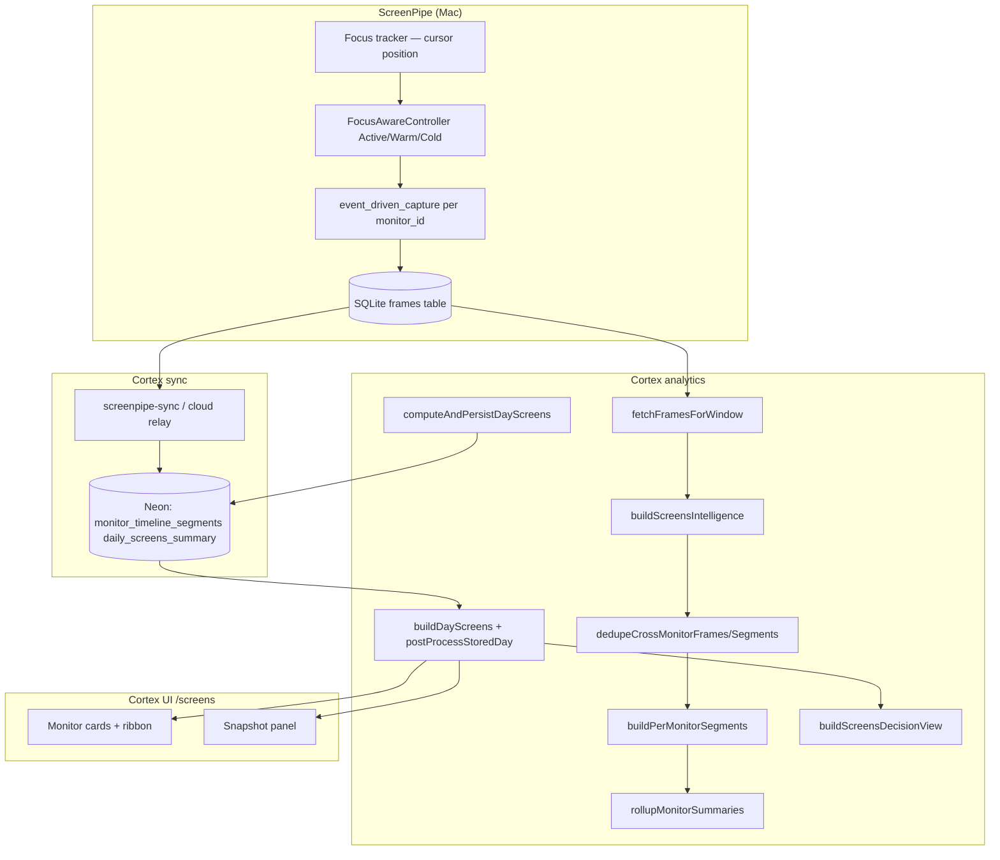

# Multi-Monitor Analytics — Architecture Analysis

**Date:** 2026-06-19  
**Phase:** 0 — investigation (no implementation in this document)  
**Authority:** Implements investigation deliverables for [`MULTI_MONITOR_ANALYTICS_DECISION_MEMO.md`](./MULTI_MONITOR_ANALYTICS_DECISION_MEMO.md)

---

## 1. Executive summary

Monitor time on the Screens page is **not** calculated from mouse position or Cortex-side focus logic. Cortex attributes duration using **gaps between indexed ScreenPipe frames**, grouped by `device_name`.

Secondary monitors undercount because **ScreenPipe stops writing frames** when a display loses focus (Warm → Cold capture policy). Cortex then has nothing to extend into multi-hour segments.

A second contributor: **cross-monitor deduplication** in Cortex collapses identical app+title+domain segments across displays. That fixed mirrored-foreground bugs but violates the decision memo when two monitors show legitimately different content with similar metadata, and it **prevents intentional overlap** when ScreenPipe records the same foreground window on multiple displays.

**Primary root cause:** capture evidence starvation on unfocused monitors (ScreenPipe).  
**Secondary:** dedupe policy (Cortex).  
**Not root cause:** Cortex aggregation math, pointer tracking in Cortex, or `focused` flag weighting (confidence only).

---

## 2. Current end-to-end flow



### Pipeline trigger order

After ScreenPipe sync, `rebuildDerivedLayers()` runs (`playground/lib/sync/pipeline-derived-layers.ts`):

1. open loops → reviews → search index  
2. **attention** (`computeAndPersistDayAttention`)  
3. **screens** (`computeAndPersistDayScreens`)  
4. project health  

Screens and Attention are **sibling pipelines**. Attention does not feed Screens today.

---

## 3. Where monitor time is calculated

### 3.1 Ingestion (ScreenPipe → SQLite)

| Step | Location | Behavior |
|------|----------|----------|
| Per-monitor capture loop | `Screenpipe/crates/screenpipe-engine/src/vision_manager/manager.rs` | One loop per `monitor_id`; `device_name = format!("monitor_{}", monitor_id)` |
| Focus state | `focus_aware_controller.rs` | Active / Warm / Cold from **cursor-on-monitor** (`focus_tracker/darwin.rs`) |
| Capture gating | `event_driven_capture.rs` ~855–958 | Cold: block + release stream; Warm: 5s visual diff only; Active: full DB write |
| Frame persistence | `event_driven_capture.rs` `do_capture` | Writes `frames` row with `app_name`, `window_name`, `browser_url`, `device_name`, `focused` |
| Content dedup (engine) | `event_driven_capture.rs` ~1839+ | Skips DB write when accessibility `content_hash` unchanged (within 30s window) |

### 3.2 Aggregation (Cortex)

| Step | File | Function | Behavior |
|------|------|----------|----------|
| Load frames | `playground/lib/screenpipe-db.ts` | `fetchFramesForWindow` | All frames in day window, ordered by timestamp |
| Identity | `screens-intelligence.ts` | `parseMonitorIdentity` | `monitor_N` → id `N`, display `Monitor N+1` |
| Dedupe frames | `screens-intelligence.ts` | `dedupeCrossMonitorFrames` | Same app+title+domain within 45s across devices → keep one |
| Build segments | `screens-intelligence.ts` | `buildPerMonitorSegments` | Per `device_name`: duration = time until **next frame on same device** |
| Dedupe segments | `screens-intelligence.ts` | `dedupeCrossMonitorSegments` | Overlapping same-fingerprint across monitors → drop one |
| Rollup | `screens-intelligence.ts` | `rollupMonitorSummaries` | Sum segment `durationSec` per monitor |
| Persist | `screens-db.ts` | `computeAndPersistDayScreens` | Writes `monitor_timeline_segments` + `daily_screens_summary` |
| API read path | `screens-api.ts` | `postProcessStoredDay` | Re-applies segment dedupe + rollup on every GET |
| Decision view | `screens-decision.ts` | `buildScreensDecisionView` | Roles, ribbons, snapshots, category comparison |
| Role label | `screens-decision.ts` | `inferMonitorRole` | Top category **today** if ≥40% → "Build Monitor", etc. |

### 3.3 Critical aggregation rule (evidence-based)

```371:421:working-memory/playground/lib/analytics/screens-intelligence.ts
function buildPerMonitorSegments(
  frames: ScreenFrame[],
  ...
): MonitorTimelineSegment[] {
  const byDevice = new Map<string, ScreenFrame[]>();
  ...
  for (let i = 0; i < sorted.length; i++) {
    const curr = sorted[i]!;
    const startMs = Date.parse(curr.timestamp);
    const endMs =
      i < sorted.length - 1
        ? Date.parse(sorted[i + 1]!.timestamp)
        : dayEndMs;
    const durationSec = Math.max(0, Math.round((endMs - startMs) / 1000));
```

**Implication:** If Monitor 1 produces 3 frames over 2 hours, Cortex attributes ~2 hours to those 3 segments only if gaps are between consecutive frames on that device. If Cold produces **zero** frames for 1h 59m, that hour does not exist in analytics.

### 3.4 What `focused` does in Cortex (not duration)

```335:339:working-memory/playground/lib/analytics/screens-intelligence.ts
function segmentConfidence(frame: ScreenFrame): number {
  if (frame.focused === true) return 0.95;
  if (frame.focused === false) return 0.58;
  return 0.72;
}
```

`focused` affects **confidence only**, not whether time accrues.

---

## 4. Phase 1 — Root cause verification

### 4.1 Focus-aware capture — **CONFIRMED primary cause**

**Evidence:** `focus_aware_controller.rs`

```58:63:Screenpipe/crates/screenpipe-engine/src/focus_aware_controller.rs
const WARM_CUTOFF: Duration = Duration::from_millis(2_000);
const COLD_CUTOFF: Duration = Duration::from_millis(60_000);
```

```935:958:Screenpipe/crates/screenpipe-engine/src/event_driven_capture.rs
CaptureState::Cold => {
    ...
    let notify = focus_controller.notify_for(monitor_id);
    tokio::select! {
        _ = notify.notified() => {}
        _ = tokio::time::sleep(Duration::from_secs(5)) => {}
    }
    continue;
}
```

On Cold, the loop **does not capture or write frames** except a 5s wake that still `continue`s without capture unless focus returns.

**Evidence:** Focus = cursor position, not visible content

```147:148:Screenpipe/crates/screenpipe-engine/src/focus_tracker/darwin.rs
/// Resolve the current focused monitor (cursor-based) and update state.
fn resolve_and_emit(&self, monitors: &[screenpipe_screen::monitor::SafeMonitor]) {
```

**Scenario D mapping:** User on Monitor 2 for 4h → Monitor 1 enters Cold after ~62s → no frames → Cortex shows minutes not hours.

### 4.2 Warm state — **CONFIRMED secondary cause**

Warm monitors (`event_driven_capture.rs` ~869–933):

- Visual check every **~5s** (`WARM_VISUAL_CHECK_INTERVAL`)
- DB write only if pixel diff > threshold (~5%)
- Static video UI (YouTube controls hidden, minimal pixel change) may **never** trigger a write

Additionally, on transition to Cold, `release_capture_stream()` is called (`~861–863`), tearing down the capture stream.

### 4.3 Sparse frame generation — **CONFIRMED (symptom of 4.1–4.2)**

Production observation (2026-06-18 API): Monitor with `focused` always `0.72` (null) and thousands of segments on “active” display vs sparse segments on secondary. Frame count correlates with capture state, not wall-clock visibility.

Cortex does **not** interpolate or extend segments across capture gaps beyond the next frame on the same device.

### 4.4 Cross-monitor deduplication — **CONFIRMED secondary cause**

Fingerprint (`screens-intelligence.ts`):

```96:101:working-memory/playground/lib/analytics/screens-intelligence.ts
function frameFingerprint(frame: ScreenFrame): string {
  const app = normalizeAppName(frame.app_name);
  const title = (frame.window_name ?? "").trim().toLowerCase();
  const domain = extractDomain(...) ?? "";
  return `${app}|${title}|${domain}`;
}
```

Segment dedupe drops overlapping segments with **same fingerprint** on different `monitorId` (`dedupeCrossMonitorSegments`, overlap ≥45% of shorter segment).

**Fails decision memo:** Chrome+YouTube vs Chrome+Gmail have different fingerprints → safe.  
**Problem cases:** Same foreground window recorded on two monitors (ScreenPipe behavior) → dedupe removes overlap intentionally.  
**Fails Scenario B:** If both monitors had full timelines, dedupe would still remove mirrored segments — overlap is suppressed in totals.

Applied on **sync** (`buildScreensIntelligence`) and **every API read** (`postProcessStoredDay`).

### 4.5 Aggregation logic — **NOT primary cause**

Per-device gap math is consistent with “indexed evidence time.” The model would be correct **if** frame evidence were complete. Overlap across monitors is allowed in rollup (`totalVisibleSec` sums all monitors).

### 4.6 Role classification — **design gap, not undercount cause**

```111:115:working-memory/playground/lib/analytics/screens-decision.ts
function inferMonitorRole(summary: MonitorDailySummary): MonitorRoleLabel {
  ...
  const pct = top.durationSec / summary.totalSec;
  if (pct < ROLE_THRESHOLD) return "Mixed Use";
```

Single-day dominant category → unstable labels. Does not affect duration math.

---

## 5. Related systems (not used by Screens today)

| System | File | Per-monitor? | Used by Screens? |
|--------|------|--------------|------------------|
| Attention attribution | `attention-attribution.ts` | No — global frame timeline | No |
| Visible vs attention time | `attention-attribution.ts` | Global rollups | Attention API only |
| UI events | `screenpipe-db.ts` `fetchUiEventsForWindow` | Events lack `device_name` in standard fetch | No |
| Activity / Today view | `analytics-api.ts` | Merged sessions | Separate route |

Attention already splits **visibleTime** vs **attentionTime** globally — a pattern to reuse for Layer A/B, but **not per monitor** today.

---

## 6. UI state

| Component | File | Capability |
|-----------|------|------------|
| Monitor cards | `screens-view.tsx` | Per-monitor totals, categories, top apps |
| Ribbon | `MonitorRibbon` in `screens-view.tsx` | 2px 24h category strip per card |
| Snapshots | `screens-snapshot-panel.tsx` | Point-in-time per monitor |
| Segment drawer | `MonitorDetailsSheet` | Full segment list per monitor |
| **Missing** | — | Synchronized multi-monitor timeline, focus lane, zoom |

---

## 7. Affected files (implementation touch map)

### ScreenPipe (capture — Phase 3)

| File | Change |
|------|--------|
| `crates/screenpipe-engine/src/focus_aware_controller.rs` | New state or policy for background visibility |
| `crates/screenpipe-engine/src/event_driven_capture.rs` | Cold/Warm sampling, segment extension, content_hash persistence |
| `crates/screenpipe-engine/src/vision_manager/manager.rs` | Config surface for visibility-first mode |
| `crates/screenpipe-db` | Optional `content_hash`, `capture_state` on frames |

### Cortex (analytics — Phases 2, 4, 5)

| File | Change |
|------|--------|
| `playground/lib/analytics/screens-intelligence.ts` | Layer A/B split, mirror-only dedupe |
| `playground/lib/analytics/screens-api.ts` | New DTO fields, interaction timelines |
| `playground/lib/analytics/screens-decision.ts` | Roles from 30d profile |
| `playground/lib/analytics/screens-db.ts` | New tables / segment_type |
| `playground/lib/repositories/screens-repository.ts` | interaction + role tables |
| `playground/lib/screenpipe-db.ts` | Fetch ui_events with monitor attribution if added |
| `playground/scripts/migrate-screens-intelligence.ts` | Schema migration |

### Cortex UI (Phase 6)

| File | Change |
|------|--------|
| `apps/cortex-ui/src/components/screens/` | `MultiMonitorTimeline` component |
| `apps/cortex-ui/src/lib/api/types.ts` | Interaction timeline types |

### Docs

| File | Status |
|------|--------|
| `docs/MULTI_MONITOR_ANALYTICS_DECISION_MEMO.md` | Source of truth ✓ |
| `MULTI_MONITOR_INTELLIGENCE_REPORT.md` | Phase 15.6 historical audit |
| This file | Phase 0 analysis |

---

## 8. Recommended architecture

### 8.1 Two-layer analytics model

```
┌─────────────────────────────────────────────────────────┐
│ Layer A: Display visibility (PRIMARY — Screens default) │
│  • Source: per-monitor frames / visibility samples      │
│  • Metric: wall-clock visible content on that display   │
│  • Overlap: allowed (M1=8h + M2=8h = 16h visible)      │
└─────────────────────────────────────────────────────────┘
┌─────────────────────────────────────────────────────────┐
│ Layer B: User interaction (SECONDARY — focus lane)        │
│  • Source: ui_events + focus tracker + keyboard/mouse   │
│  • Metric: time user actively interacted per monitor    │
│  • Overlap: N/A (user has one focus at a time)          │
└─────────────────────────────────────────────────────────┘
```

### 8.2 Capture architecture (ScreenPipe)

Replace Cold “zero evidence” with **Background visibility sampling**:

| State | Proposed behavior |
|-------|-------------------|
| Active | Unchanged — full a11y + DB write |
| Warm | Periodic sample (30–60s) + extend segment if `content_hash` matches |
| Cold | Light sample (60–120s) + **always extend** last segment for unchanged content |

**Segment extension:** If sample N matches sample N-1 on same `device_name`, update `end_time` without requiring new OCR.

**Power profile:** Scale intervals via existing `power/profile.rs` — do not disable background sampling entirely on battery.

### 8.3 Dedupe architecture (Cortex)

Replace fingerprint-only dedupe with **mirror detection**:

```
dedupe IF:
  fingerprint_match
  AND timestamp_overlap > threshold
  AND (pixel_similarity > threshold OR os_mirror_flag)
ELSE: keep both segments
```

Never dedupe on app alone. Chrome/YouTube ≠ Chrome/Gmail by construction (different title/domain).

### 8.4 Role architecture (Cortex)

```
monitor_role_profiles (
  monitor_id PK,
  role_label,
  category_mix JSONB,  -- 30d percentages
  window_days INT DEFAULT 30,
  updated_at
)
```

Nightly job from Layer A segments. UI reads stable role; daily card shows intraday mix.

### 8.5 Timeline API shape

```typescript
type DayScreensV2 = {
  date: string;
  monitors: MonitorIdentity[];
  displayTimelines: Record<string, TimelineSegment[]>;  // Layer A
  interactionTimeline: InteractionSegment[];            // Layer B (global or per-monitor)
  roles: Record<string, MonitorRoleProfile>;
  ...
}
```

---

## 9. Technical design — acceptance test mapping

| Scenario | Current | After full fix |
|----------|---------|----------------|
| **A** YouTube M1 + VS Code M2, 9–11, focus M2 | M1 ~minutes | M1 2h entertainment, M2 2h build |
| **B** Netflix M1 + work M2 all day | Undercount + dedupe risk | Both full timelines, overlapping |
| **C** Mirrored displays | Dedupe may help; no mirror flag | Explicit mirror detection |
| **D** M1 unfocused 4h, content visible | Near-zero frames | Continuous segment extension |
| **E** Chrome/YT vs Chrome/Gmail | OK if titles differ | Must remain separate |

---

## 10. Implementation plan (phased)

| Phase | Scope | Repo | Depends on |
|-------|-------|------|------------|
| **0** | This analysis + decision memo | Cortex | — |
| **1** | Background visibility sampling + segment extension | ScreenPipe | — |
| **2** | Layer A/B schema + aggregation split | Cortex | Phase 1 frames |
| **3** | Mirror-only dedupe; remove blanket cross-monitor dedupe | Cortex | Phase 1 |
| **4** | 30-day rolling monitor roles | Cortex | Phase 2 |
| **5** | `MultiMonitorTimeline` UI (primary view) | Cortex UI | Phase 2 API |
| **6** | Backfill + feature flag `screens_v2` | Both | Phases 1–3 |

**Hard rule:** Do not ship Phase 5 before Phase 1 passes Scenario A and D in integration tests.

---

## 11. Migration strategy

### Data

| Artifact | Migration |
|----------|-----------|
| `monitor_timeline_segments` | Add `segment_type` (`display_visible` \| `user_interaction`); default legacy rows to `display_visible` |
| Historical days | Label `capture_quality: "cold_limited"` in API for dates before ScreenPipe fix |
| Backfill | Re-run `computeAndPersistDayScreens` from SQLite frames — **cannot recover Cold gaps** if frames were never written |
| API | `GET /api/screens/day` v1 unchanged; v2 adds `interactionTimelines` + `roles` |

### Risk

| Risk | Severity | Mitigation |
|------|----------|------------|
| Pre-fix history permanently undercounted | High | UI badge "limited capture before Jun 2026" |
| Battery impact from background sampling | Medium | Power-profile intervals; user setting |
| Double-count mirrors | Medium | Scenario C tests + pixel hash |
| Worker CPU on read-path dedupe | Low | Move dedupe to sync-only after Phase 3 |

### Rollback

- ScreenPipe: feature flag `visibility_first_capture` default off until validated  
- Cortex: `screens_v2=false` serves current API shape

---

## 12. Tests required

### ScreenPipe integration

- Two-monitor fixture: focus on M2 for 2h, static content on M1 → M1 frame count > 1 per minute equivalent  
- Segment extension: unchanged content_hash extends DB row timestamp  

### Cortex unit

- `buildPerMonitorSegments`: overlapping M1/M2 totals sum to > 24h  
- Mirror dedupe: identical content on two monitors → single count  
- Non-mirror: Chrome/YT + Chrome/Gmail → both counted  

### E2E

- `/api/screens/day` Scenario A–D assertions  
- UI screenshot: stacked timeline with 2 lanes + focus lane  

---

## 13. Conclusion

The product principle in the decision memo is **correct** and **not yet implemented end-to-end**.

| Layer | Aligns with "display visible time"? |
|-------|-------------------------------------|
| ScreenPipe capture | **No** — Cold stops evidence |
| Cortex aggregation | **Partially** — math is per-device but input-starved |
| Cortex dedupe | **No** — suppresses overlap |
| Cortex UI | **Partially** — per-monitor cards exist; no primary timeline |
| Monitor roles | **No** — daily only |
| User interaction layer | **No** — not exposed per monitor on Screens |

**Next engineering action:** Phase 1 in ScreenPipe (`event_driven_capture.rs` + `focus_aware_controller.rs`) — not Cortex UI.

---

## 14. References

- Decision memo: `docs/MULTI_MONITOR_ANALYTICS_DECISION_MEMO.md`
- Phase 15.6 shipped audit: `MULTI_MONITOR_INTELLIGENCE_REPORT.md`
- UX targets: `SCREENS_UX_REDESIGN_REPORT.md`
