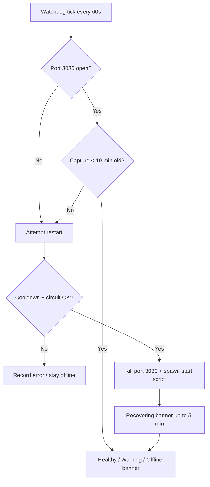

# ScreenPipe Reliability & Auto-Recovery

Cortex keeps ScreenPipe capture running without manual intervention. The playground backend (`:3456`) runs a startup watchdog, polls health, and auto-restarts the engine when needed.

## Architecture

```
cortex-ui (banner)  →  GET /api/system/screenpipe-health  →  playground watchdog
                                                              ↓
                                                    start-screenpipe.sh
                                                              ↓
                                              screenpipe record :3030
                                                              ↓
                                              screenpipe-data/db.sqlite
```

| Component | Path |
|-----------|------|
| Watchdog | `playground/lib/system/screenpipe-watchdog.ts` |
| Health probe | `playground/lib/system/screenpipe-probe.ts` |
| Auto-restart | `playground/lib/system/screenpipe-restart.ts` |
| Diagnostics store | `playground/lib/system/screenpipe-reliability-store.ts` |
| Startup hook | `playground/instrumentation.ts` |
| Start script | `/Volumes/Kasliwal v2/start-screenpipe.sh` |

## Health API

`GET /api/system/screenpipe-health`

```json
{
  "running": false,
  "status": "offline",
  "portOpen": false,
  "apiReachable": false,
  "lastCaptureAt": "2026-06-17T02:24:11.907836+00:00",
  "minutesSinceLastCapture": 905,
  "frameCountToday": 0,
  "uiEventCountToday": 0,
  "audioCountToday": 0,
  "lastRestartAt": null,
  "restartCount": 0,
  "lastError": null
}
```

### Dashboard status

| Status | Condition |
|--------|-----------|
| **Healthy** | Last capture ≤ 5 minutes |
| **Warning** | Last capture 6–30 minutes |
| **Offline** | Last capture > 30 minutes, or no data |
| **Recovering** | Restart within last 5 minutes and captures not yet healthy |

`running` is `true` when the API is up and captures are fresh (≤ 5 min).

## Watchdog behavior

Started when the playground Next.js server boots (`instrumentation.ts`) and on the first health API call.

Every **60 seconds** the watchdog:

1. Probes TCP port **3030**
2. Calls `GET http://127.0.0.1:3030/health`
3. Reads latest capture timestamps from the ScreenPipe SQLite DB
4. Decides whether a restart is needed

### Auto-restart triggers

| Trigger | Condition |
|---------|-----------|
| Process down | Port 3030 not listening |
| Unexpected exit | Same as above — port closed |
| Stale capture | No new frames/ui/audio for **≥ 10 minutes** while port may still be open |

### Restart safeguards

| Guard | Value |
|-------|-------|
| Cooldown between restarts | 30 seconds |
| Circuit breaker | Max **3** restarts per **10 minutes** |
| Recovery window | 5 minutes (dashboard shows **Recovering**) |

Restart runs `SCREENPIPE_START_SCRIPT` (default: `../../start-screenpipe.sh` from playground) detached via `bash`. Orphan processes on port 3030 are killed first (`lsof`).

## Diagnostics

Stored in `working-memory.db` → `screenpipe_reliability` (single row):

| Field | Column |
|-------|--------|
| `lastRestartAt` | `last_restart_at` |
| `restartCount` | `restart_count` (lifetime) |
| `lastError` | `last_error` |

Restart history (last 20 timestamps) is kept for the circuit breaker.

## Failure modes

| Failure | Symptoms | Auto-recovery |
|---------|----------|---------------|
| Process crash | Port 3030 closed, captures stop | Watchdog restarts within ~60s |
| Hung engine | Port open, no new DB rows for 10+ min | Watchdog kills port + restarts |
| Port conflict | Restart fails, `last_error` set | Manual kill + restart (see below) |
| DB migration / boot | `/health` slow or degraded | Watchdog may retry; wait for healthy `/health` |
| Circuit breaker open | 3 restarts in 10 min | Auto-restart paused; `last_error` notes breaker |
| Missing start script | `SCREENPIPE_START_SCRIPT` not found | No restart; error stored |
| External drive unmounted | DB / script unreachable | Offline; fix mount manually |
| DB corruption | Restarts loop without new captures | Stop watchdog, run `screenpipe db recover` |

## Recovery flow



## Manual recovery steps

1. **Check health**
   ```bash
   curl -s http://127.0.0.1:3456/api/system/screenpipe-health | jq
   curl -s http://127.0.0.1:3030/health
   ```

2. **Restart ScreenPipe manually**
   ```bash
   lsof -ti:3030 | xargs kill -9 2>/dev/null || true
   nohup "/Volumes/Kasliwal v2/start-screenpipe.sh" > ~/screenpipe.log 2>&1 &
   ```

3. **Tail logs**
   ```bash
   tail -f ~/screenpipe.log
   ```

4. **Verify captures**
   ```bash
   sqlite3 "/Volumes/Kasliwal v2/screenpipe-data/db.sqlite" \
     "SELECT MAX(timestamp) FROM frames;"
   ```

5. **Reset circuit breaker** (if auto-restart paused after 3 failures)
   ```bash
   sqlite3 "/Volumes/Kasliwal v2/working-memory/working-memory.db" \
     "UPDATE screenpipe_reliability SET restart_history='[]', last_error=NULL WHERE id=1;"
   ```

6. **Disable watchdog** (debug only)
   ```bash
   SCREENPIPE_WATCHDOG=0 bun run dev
   ```

## Environment variables

| Variable | Default | Purpose |
|----------|---------|---------|
| `SCREENPIPE_DB` | `$SCREENPIPE_DATA_DIR/db.sqlite` | Capture DB path |
| `SCREENPIPE_PORT` | `3030` | Engine port |
| `SCREENPIPE_API_URL` | `http://127.0.0.1:3030` | Health probe base URL |
| `SCREENPIPE_START_SCRIPT` | `../../start-screenpipe.sh` | Restart command |
| `SCREENPIPE_WATCHDOG` | enabled | Set `0` to disable auto-restart |

## Production recommendation

For maximum uptime, also register ScreenPipe with **launchd** (`KeepAlive=true`) so the OS supervises the process when Cortex is not running. The playground watchdog is a second layer when Cortex is active.
